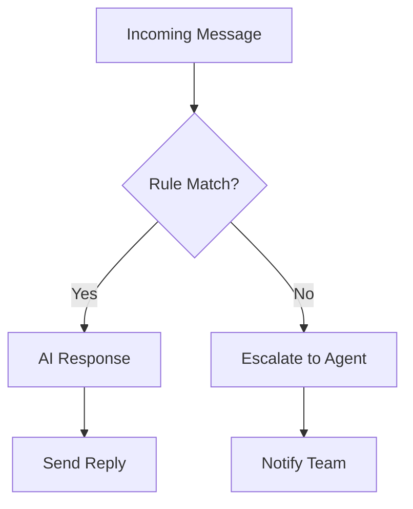

## Overview

Botat AI empowers you to manage WhatsApp communications with advanced AI tools. You can create personalized messages, segment customers, automate responses, and track performance metrics. These features help you build stronger relationships and drive growth through smarter messaging.

<Callout kind="info">
Botat AI integrates seamlessly with WhatsApp Business API for reliable delivery.
</Callout>

## Key Features

Discover the core capabilities that make Botat AI stand out.

<Columns cols={2}>
  <Card title="AI-Powered Messaging" icon="zap" href="#ai-messaging">
    Generate and personalize messages using AI for higher engagement.
  </Card>
  <Card title="Customer Segmentation" icon="users" href="#segmentation">
    Target specific groups based on behavior and attributes.
  </Card>
  <Card title="Automation Rules" icon="settings" href="#automation">
    Set up rules for instant, context-aware responses.
  </Card>
  <Card title="Performance Analytics" icon="bar-chart-3" href="#analytics">
    Measure campaign success with detailed insights.
  </Card>
</Columns>

## AI-Powered Message Creation and Personalization

### AI Messaging

Use Botat AI to craft messages that feel personal and relevant. The AI analyzes customer data to suggest content, tone, and timing.

<Steps>
  <Step title="Generate Message" icon="edit-3">
    Select your audience and provide context.

````javascript
const aiResponse = await fetch('https://api.example.com/v1/ai/messages', {
  method: 'POST',
  headers: { 'Authorization': 'Bearer YOUR_API_KEY' },
  body: JSON.stringify({
    prompt: 'Welcome back {customerName}! Your last order was great.',
    audience: 'loyal-customers'
  })
});
````

  </Step>
  <Step title="Personalize" icon="user">
    Insert dynamic variables like `{customerName}` or `{lastPurchase}`.

    Review AI suggestions before sending.
  </Step>
  <Step title="Send via WhatsApp" icon="send">
    Deploy to WhatsApp with one click.
  </Step>
</Steps>

## Customer Segmentation and Targeting

### Segmentation

Divide your customers into segments for targeted campaigns. Use criteria like location, purchase history, or engagement level.

<Tabs>
  <Tab title="By Behavior" icon="activity">
    Target active users.

````javascript
const segments = await fetch('https://api.example.com/v1/segments', {
  headers: { 'Authorization': 'Bearer YOUR_API_KEY' }
});
// Response: [{ id: 'active', name: 'Active Users', count: 1500 }]
````
  </Tab>
  <Tab title="By Demographics" icon="map-pin">
    Filter by region or age.

    Create segments via dashboard or API.
  </Tab>
</Tabs>

<Callout kind="tip">
Combine multiple criteria for precise targeting and better results.
</Callout>

## Automation Rules for Responses

### Automation

Set rules to handle common queries automatically, saving time and ensuring consistency.



<CodeGroup tabs="JavaScript,Python">
````javascript
// Create automation rule
await fetch('https://api.example.com/v1/automation/rules', {
  method: 'POST',
  headers: { 'Authorization': 'Bearer YOUR_API_KEY' },
  body: JSON.stringify({
    trigger: 'contains:order status',
    response: 'Your order {orderId} is shipped!'
  })
});
````
````python
import requests
response = requests.post(
    'https://api.example.com/v1/automation/rules',
    headers={'Authorization': 'Bearer YOUR_API_KEY'},
    json={
        'trigger': 'contains:order status',
        'response': 'Your order {orderId} is shipped!'
    }
)
````
</CodeGroup>

## Analytics for Message Performance

### Analytics

Track open rates, replies, and conversions to optimize your strategy.

| Metric          | Description                          | Target Goal |
|-----------------|--------------------------------------|-------------|
| Delivery Rate   | % of messages delivered              | `>99%`     |
| Reply Rate      | % of messages with replies           | `>20%`     |
| Conversion Rate | % leading to sales                   | `>5%`      |

<Expandable title="View Detailed Reports" default-open="true">
Access reports via API or dashboard.

````javascript
const metrics = await fetch('https://api.example.com/v1/analytics/messages?date_from=2024-01-01');
console.log(metrics); // { delivery: 99.5, replies: 25 }
````
</Expandable>

These features work together to streamline your WhatsApp operations. Start with [AI messaging](#ai-messaging) for quick wins.