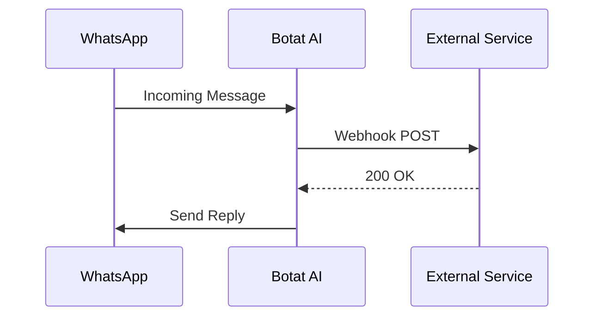

## Overview

Botat AI supports seamless integrations with popular CRMs, automation tools, and custom APIs. Use built-in connectors for HubSpot and Zapier, or configure webhooks for WhatsApp message events and custom data flows. This enables automated workflows like syncing customer data or triggering actions on incoming messages.

<Callout kind="info">
Before starting, ensure you have:
- An active Botat AI account
- Admin access to your CRM or target service
- A public HTTPS endpoint for incoming webhooks (use ngrok for testing)
</Callout>

## Available Integrations

Explore pre-built integrations to extend Botat AI without custom code.

<Columns cols={3}>
  <Card title="HubSpot" icon="users" href="#hubspot-setup">
    Sync contacts and deals from WhatsApp conversations.
  </Card>
  <Card title="Zapier" icon="zap" href="https://zapier.com" target="_blank">
    Connect to 5000+ apps with no-code automations.
  </Card>
  <Card title="Custom Webhook" icon="plug" href="#webhook-setup">
    Receive real-time events for advanced workflows.
  </Card>
</Columns>

## HubSpot Integration

Connect Botat AI to HubSpot to automatically create or update contacts based on WhatsApp interactions.

### Setup Steps

<Steps>
  <Step title="Generate API Key" icon="key">
    In your Botat AI dashboard, navigate to Integrations > HubSpot. Click "Generate Key" and copy the `API_KEY`.
  </Step>
  <Step title="Configure HubSpot" icon="settings">
    In HubSpot, go to Settings > Integrations > Private Apps. Create a new app with scopes: `crm.objects.contacts.write`.
  </Step>
  <Step title="Link Accounts">
````javascript
// Example API call to link (use in Botat AI dashboard)
fetch('https://api.example.com/v1/integrations/hubspot', {
  method: 'POST',
  headers: { 'Authorization': 'Bearer YOUR_BOTAT_TOKEN', 'Content-Type': 'application/json' },
  body: JSON.stringify({
    hubspotApiKey: 'YOUR_HUBSPOT_KEY',
    syncContacts: true
  })
});
````
  </Step>
</Steps>

<Callout kind="tip">
Test the integration with a sample WhatsApp message to verify contact creation in HubSpot.
</Callout>

## WhatsApp Webhook Configuration

Set up webhooks to receive real-time notifications for incoming messages, deliveries, and status updates.

### Webhook Payload Structure

Use these `<ParamField>` components to understand the expected data.

<ParamField path="entry.0.changes.0.value.messages.0.from" param-type="string" required="true">
  Sender's WhatsApp phone number (e.g., `1234567890`).
</ParamField>

<ParamField body="entry.0.changes.0.value.messages.0.text.body" param-type="string">
  Message content.
</ParamField>

<ParamField header="X-Botat-Signature" param-type="string" required="true">
  HMAC signature for webhook verification using your `WEBHOOK_SECRET`.
</ParamField>

### Example Incoming Webhook

<Response tabs="200" show-lines="true">
```json
{
  "entry": [{
    "changes": [{
      "value": {
        "contacts": [{"wa_id": "1234567890"}],
        "messages": [{
          "from": "1234567890",
          "text": {"body": "Hello from customer"}
        }]
      }
    }]
  }]
}
```
</Response>

## Custom API Connections

Send data from Botat AI to your custom endpoints using API triggers.

<Tabs>
  <Tab title="JavaScript" icon="code">
````javascript
// Trigger on new message
const payload = {
  phone: '1234567890',
  message: 'Customer inquiry',
  timestamp: new Date().toISOString()
};

await fetch('https://your-webhook-url.com/webhook', {
  method: 'POST',
  headers: { 'Content-Type': 'application/json' },
  body: JSON.stringify(payload)
});
````
  </Tab>
  <Tab title="Python" icon="python">
````python
import requests
import json
from datetime import datetime

payload = {
    "phone": "1234567890",
    "message": "Customer inquiry",
    "timestamp": datetime.utcnow().isoformat()
}

requests.post(
    "https://your-webhook-url.com/webhook",
    headers={"Content-Type": "application/json"},
    json=payload
)
````
  </Tab>
</Tabs>

## Event Handling Flow

Visualize how events flow between WhatsApp, Botat AI, and your services.



## Best Practices

- Always verify webhook signatures to prevent spoofing.
- Use HTTPS endpoints only.
- Implement retry logic for failed deliveries.

<Expandable title="Advanced: Outgoing Data Events" default-open="false">
Configure outgoing events for analytics or logging.

<CodeGroup tabs="Node.js,Python">
```javascript
// Node.js listener
app.post('/webhook', (req, res) => {
  console.log('Event:', req.body);
  res.status(200).send('OK');
});
```
```python
# Python Flask
from flask import Flask, request

app = Flask(__name__)

@app.route('/webhook', methods=['POST'])
def webhook():
    print('Event:', request.json)
    return 'OK', 200
```
</CodeGroup>
</Expandable>

<Columns cols={2}>
  <Card title="Next: Authentication" icon="lock" href="/authentication">
    Secure your integrations.
  </Card>
  <Card title="API Reference" icon="book-open" href="/api-reference">
    Full endpoint details.
  </Card>
</Columns>