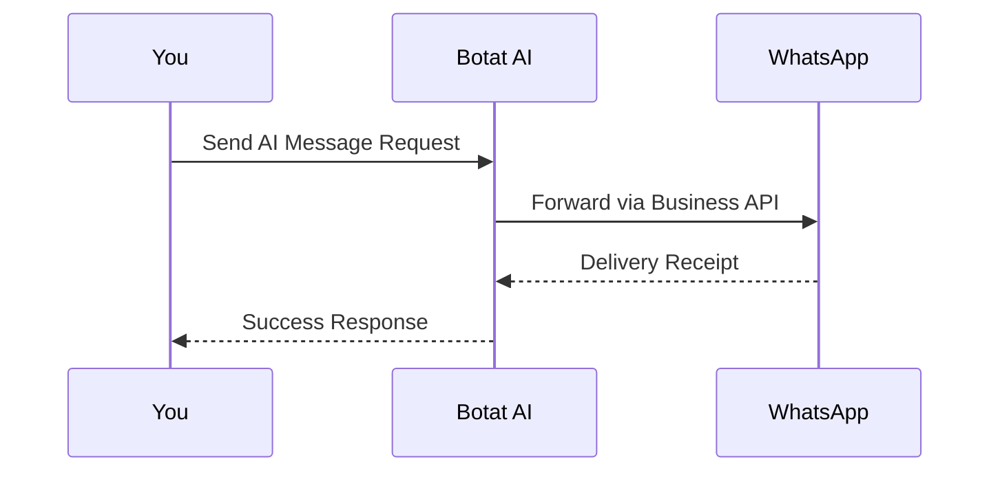

## Prerequisites

<Callout kind="info" title="Before You Begin">
To get started with Botat AI, ensure you have:
- A WhatsApp Business account (free to create via Meta Business Suite)
- Access to your phone number for WhatsApp verification
- A web browser for the dashboard at `https://dashboard.botat.ai`
- No credit card required for the initial setup
</Callout>

Botat AI simplifies WhatsApp messaging with AI-powered automation. Follow these steps to connect your WhatsApp Business API, configure your dashboard, and send your first AI-generated message.

## Step 1: Create Your Account

1. Visit `https://botat.ai` and click **Sign Up**.
2. Enter your email, phone number, and create a password.
3. Verify your email via the confirmation link sent to your inbox.

Once registered, you'll receive an API key from the dashboard. Store it securely as `YOUR_API_KEY`.

<CodeGroup tabs="cURL,JavaScript">
````curl
curl -X POST https://api.example.com/v1/auth/register \
  -H "Content-Type: application/json" \
  -d '{
    "email": "your-email@example.com",
    "password": "your-password"
  }'
````

````javascript
const response = await fetch('https://api.example.com/v1/auth/register', {
  method: 'POST',
  headers: { 'Content-Type': 'application/json' },
  body: JSON.stringify({
    email: 'your-email@example.com',
    password: 'your-password'
  })
});
const data = await response.json();
console.log(data.apiKey); // Store this securely
````
</CodeGroup>

## Step 2: Connect WhatsApp Business API

Navigate to the **Integrations** tab in your dashboard at `https://dashboard.botat.ai/integrations/whatsapp`.

<Steps>
  <Step title="Add Phone Number" icon="phone">
    Enter your WhatsApp Business phone number and request a verification code from Meta.

    <Image
      src="https://framerusercontent.com/images/klui2LLRQBdbyFubR7YMjvGySA.jpg"
      alt="WhatsApp integration setup screen"
      width="800"
      height="450"
    />
  </Step>

  <Step title="Verify and Connect" icon="check-circle">
    Input the 6-digit code received on WhatsApp. Botat AI will handle the API connection automatically.
  </Step>
</Steps>

<Callout kind="tip">
Your connection achieves `99.95%` uptime with 30-day monitoring (excludes scheduled maintenance).
</Callout>

## Step 3: Initial Dashboard Setup

In the dashboard:
- Set your default AI model (e.g., GPT-4o for smart replies).
- Configure message templates under **Templates** > **AI Responses**.
- Test connectivity by sending a ping to your WhatsApp number.

## Send Your First AI Message

Use the Botat AI API to send an AI-generated message. Replace `YOUR_API_KEY` and `PHONE_NUMBER` with your values.

<Request tabs="cURL,JavaScript,Python" show-lines="true">
````curl
curl -X POST https://api.example.com/v1/messages/send \
  -H "Authorization: Bearer YOUR_API_KEY" \
  -H "Content-Type: application/json" \
  -d '{
    "to": "PHONE_NUMBER",
    "message": "Generate a welcome message for new customers",
    "aiPrompt": "Friendly and promotional tone"
  }'
````

````javascript
const response = await fetch('https://api.example.com/v1/messages/send', {
  method: 'POST',
  headers: {
    'Authorization': 'Bearer YOUR_API_KEY',
    'Content-Type': 'application/json'
  },
  body: JSON.stringify({
    to: 'PHONE_NUMBER',
    message: 'Generate a welcome message for new customers',
    aiPrompt: 'Friendly and promotional tone'
  })
});
````

````python
import requests

response = requests.post(
    'https://api.example.com/v1/messages/send',
    headers={
        'Authorization': 'Bearer YOUR_API_KEY',
        'Content-Type': 'application/json'
    },
    json={
        'to': 'PHONE_NUMBER',
        'message': 'Generate a welcome message for new customers',
        'aiPrompt': 'Friendly and promotional tone'
    }
)
````
</Request>

<Response tabs="200,400">
````json
{
  "status": "success",
  "messageSid": "msg_abc123",
  "deliveryStatus": "sent"
}
````

````json
{
  "status": "error",
  "code": 400,
  "message": "Invalid phone number"
}
````
</Response>

<ParamField path="to" param-type="string" required="true">
Target WhatsApp phone number in E.164 format (e.g., `+1234567890`).
</ParamField>

<ParamField query="aiPrompt" param-type="string" required="false">
Custom AI instruction for message generation.
</ParamField>

## Next Steps

Explore more features to scale your WhatsApp automation.

<Columns cols={3}>
  <Card title="Authentication" icon="lock" href="/authentication">
    Secure your API access with advanced auth methods.
  </Card>

  <Card title="Advanced Templates" icon="file-text" href="/introduction">
    Build sophisticated AI message templates.
  </Card>

  <Card title="Changelog" icon="git-branch" href="/changelog">
    Stay updated with the latest releases.
  </Card>
</Columns>



<Expandable title="Troubleshooting Common Issues" default-open="false">
- **Connection failed?** Ensure your phone number is verified in Meta Business Manager.
- **Rate limits?** Check dashboard quotas under **Usage**.
- **API errors?** Verify `Authorization` header uses `Bearer YOUR_API_KEY`.
</Expandable>